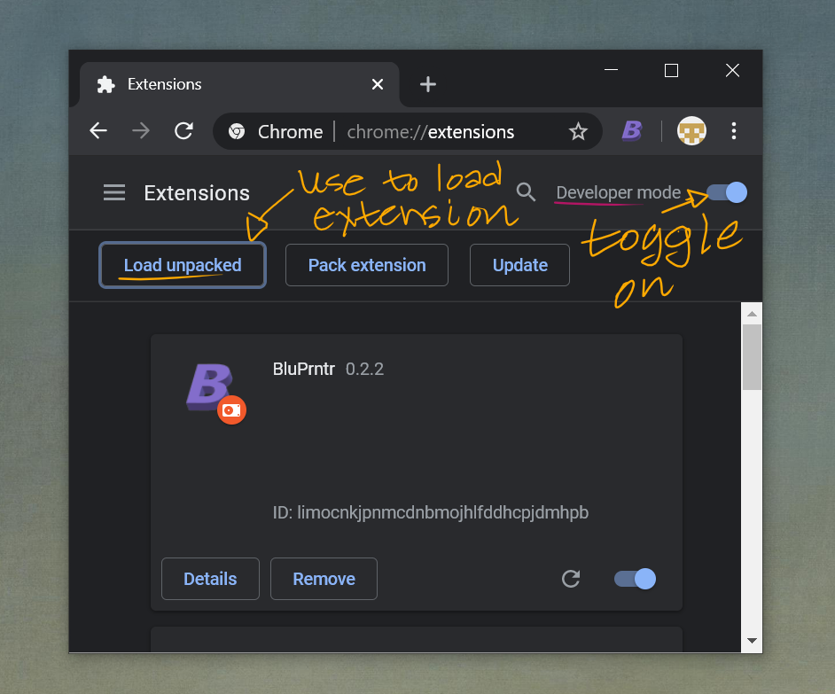

BLUPRNTR
========

A Chrome extension (and local server) that saves your Bluprint classes to disk.
Works on a Windows, Mac, or Linux machine.


Requirements
------------

The only requirement is [Node.js](https://nodejs.org/en/).

Follow [Node.js' installation instructions](https://nodejs.org/en/) for your OS:

- [Windows](https://nodejs.org/en/download/package-manager/#windows)*
- [Mac](https://nodejs.org/en/download/package-manager/#macos)
- [Linux](https://nodejs.org/en/download/package-manager)

*[Chocolatey](https://chocolatey.org/install) is the preferred method for Windows.

### Using Yarn

This application uses [Yarn](https://yarnpkg.com/).

Instructions
------------

If you are not familiar with the command line interface (CLI), provided are an introduction to the CLI in
[Windows](https://programminghistorian.org/en/lessons/intro-to-powershell#open-powershell), and in the
[Linux & Mac](https://www.codecademy.com/articles/command-line-setup) OS.

### 1. Install the Chrome Extension

A Chrome extension is provided with the project in the folder `bluprntr-chrome-extension/`.
Chrome extensions can be loaded by navigating to the url `chrome://extensions` from the browser.
Use the **Load unpacked** button to manually load the folder `bluprntr-chrome-extension/`.

<center></center>

Detailed [instructions](#installing-the-bluprntr-chrome-extension).

### 2. Install Bluprntr

The Bluprntr server must also be installed on to your system.
The following commands will install the server, and are to be executed from a command line (Powershell, bash, terminal).

```bash
# Set the current directory to the folder where bluprntr was downloaded.
cd ./bluprntr

# Install bluprntr with npm,
npm install --global

# or use yarn.
yarn global add
```

### 3. Start Bluprntr

Start the application by running `bluprntr` from the command line.

```bash
bluprntr
```

### 4. Open the _Developer Tools_ and Start a Video in Chrome

Visit the class website, **Start the Developer Tools**, and start a class video.
A copy of the video will immediately be downloaded to your system's downloads folder.
No need to watch an entire video, the download will finish in the background.

### Set Download Path

The environment variable `BLUPRNTR_DOWNLOAD_PATH` will be used as the download location.
A `.env` file can also be used.

### Process Outline

The following steps will download a class video to disk.

1. Clone/download the project from Github.
2. Install the Chrome Extension (instructions in next section).
3. Install Bluprntr: `npm install <path-to-bluprntr-project> --global` from the terminal (powershell/shell/cli).
4. Start the `bluprntr` application from the terminal.
5. Navigate to a class using Chrome.
6. Open Chrome's _Developer Tools_.
7. Start a class video.
8. Watch for output in the terminal where `bluprntr` was started.

### Installing the BluPrntr Chrome Extension

1. Navigate to chrome://extensions in your browser. You can also access this page by clicking on the Chrome menu on the top right side of the Omnibox, hovering over **More Tools** and selecting **Extensions**.
2. Check the box next to Developer Mode.
3. Click **Load Unpacked Extension** and select the directory, `bluprntr-chrome-extension/`.

More information: [What are Extensions? - Google Chrome](https://developer.chrome.com/extensions).

Contributing
------------

If you have a nice line or two of code to contribute, please create a [pull request](https://help.github.com/en/github/collaborating-with-issues-and-pull-requests/about-pull-requests)!

- BTC: 3KYBuFMpu9bfXpT1dm75cDuKkayHxwZyPP
- ETH: 0x075051F7B7264fd6A2a1F2E53E50297b8D731136
